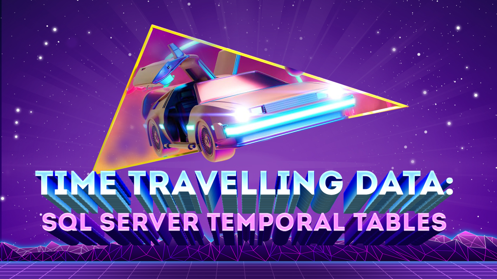

## Abstract
Have you built complicated triggers and procedures to track the history of data in your databases? What if SQL Server or Azure SQL could take care of all that for you and you just had to change a couple of settings? Starting with SQL Server 2016, there is support for system-versioned temporal tables as a database feature that brings built-in support for providing information about data stored in a table at any point in time rather than only the data that is correct as the current moment time. During this session, Chad will explain the key scenarios around the use of Temporal Tables, how system-time works, how to get started, and finish up with a demo to show you Temporal Tables in action, including the easy-to-use T-SQL syntax to implement all of the Temporal goodness. We will also look at how Entity Framework Core 6 now lets us do all this directly in Entity Framework.

## Short Abstract
During this session, Chad will explain the key scenarios around the use of Temporal Tables, how system-time works, how to get started, and finish up with a demo to show you Temporal Tables in action, including the easy-to-use T-SQL syntax to implement all of the Temporal goodness. We will also look at how Entity Framework Core 6 now lets us do all this directly in Entity Framework.

# Type
* 45/60/75-minute session

## Tags
* .NET
* Architecture
* C#
* Data
* Database
* Entity Framework
* SQL
* SQL Server

## Learning Objectives
* Understand the key scenarios around the use of SQL Server temporal tables
* Understand how to get started using temporal tables
* Understand best practices and limitations of temporal tables

## Presentations

| Event | Location | Date | Time | Room | Downloads |
|-------|:--------:|-----:|-----:|-----:|----------:|
| [Prairie Dev Con Winnipeg](https://www.prairiedevcon.com/winnipeg.html) | Winnipeg, MB | November 8, 2022 | 2:15 PM CST | TBA | [Slides](Presentations/TimeTravellingData_PDCWinnipeg.pdf) |
| [KCDC](https://www.kcdc.info/agenda) | Kansas City, MO | August 9, 2022 | 3:30 pm CDT | 2201 | [Slides](Presentations/TimeTravellingData_KCDC2022.pdf) | 
| [Beer City Code](https://www.beercitycode.com/) | Grand Rapids, MI | August 6, 2022 | 2:00 pm EDT | 255 | [Slides](Presentations/TimeTravellingData_BeerCityCode2022.pdf) | 
| [TechBash](https://techbash.com/2019-schedule) | Pocono Manor, PA | November 15, 2019 | 11:30 am EST | Rosewood | [Slides](Presentations/TimeTravelingTables-TechBash2019.pdf) | 
